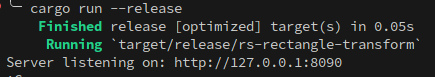
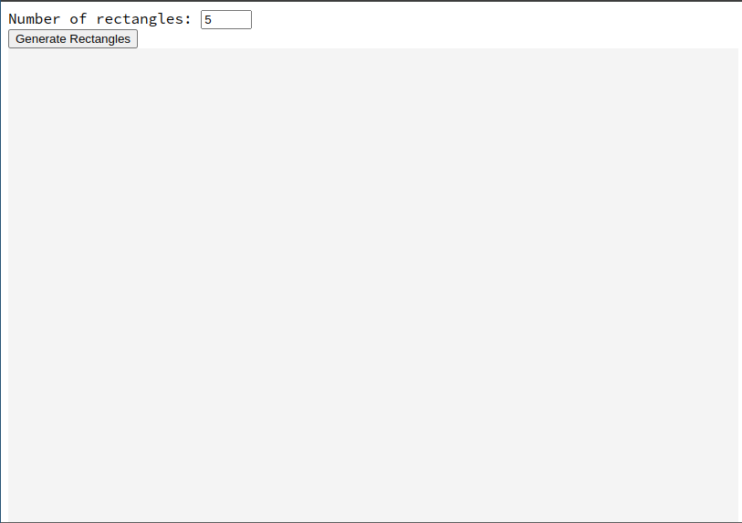
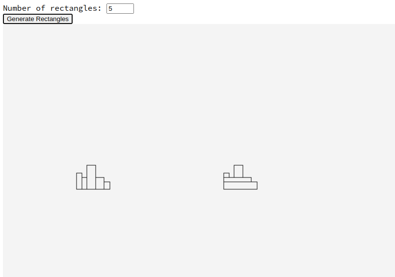

# Rectangle Transform

Generates the requested number of adjacent vertical rectangles of random width and height, sharing the same base,
and recreates the outline of theoverall shape using the minimum number of horizontal rectangles.

## Transform algorithm

- sort the source rectangles by height and iterate over them:
  - rectangle with the lowest height is always used as base;
  - lookup left and right for all adjacent rectangles higher than the current one:
    - if there are any:
      - get all the rectangles generated by previous iterations that include the current's x coordinate in order to calculate height and y coordinate.
      - left most rectangle is used to get x coordinate;
      - width is the sum of all of the adjacent rectangles' widths, including the current one
    - if there are none:
      - get the highest adjacent to calculate y coordinate and height. Width and x coordinate are persisted.

## Usage

### Start application

```sh
  cargo run --release
```



### Open web page



### Input number of rectangles and click

#### Note: Graphics are intentionally offset, see generated file for accurate coordinates


